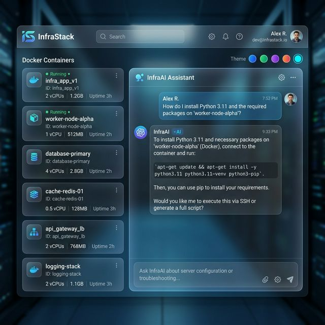
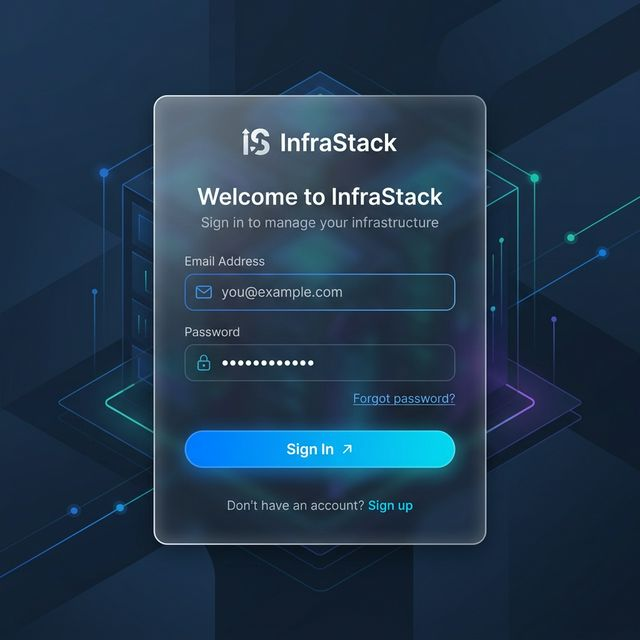

<div align="center">

# 🚀 InfraStack

### Seu Assistente de Infraestrutura Linux com IA

*Fale com seu servidor como um humano. Ele faz o resto.*

[](https://www.docker.com/)
[](https://ai.google.dev/)
[](https://www.postgresql.org/)

</div>

---


*Interface principal com dashboard de containers e chat inteligente.*

---

## ✨ Novas Funcionalidades (v2.0)

| Feature | Detalhe |
|---|---|
| 🔐 **Autenticação Completa** | Sistema de Login/Signup seguro com JWT e Cookies httpOnly |
| 🐳 **Docker Dashboard** | Monitore e gerencie containers em tempo real direto na interface |
| 📜 **Histórico de Logs** | Todo o histórico de comandos gerados e executados salvo por usuário |
| 🎨 **Temas Dinâmicos** | Troque a cor principal do projeto (Blue, Purple, Emerald, Sunset) instantaneamente |
| 🧠 **Contexto Inteligente** | O AI agora entende o estado do seu servidor através do Docker Socket |

---

## 🏗️ Arquitetura Integrada

O **InfraStack** agora utiliza uma infraestrutura robusta para persistência e monitoramento:

- **Backend**: Node.js/Express com acesso ao `/var/run/docker.sock`.
- **Database**: PostgreSQL para armazenamento de usuários e logs de comandos.
- **AI**: Gemini Pro para geração de comandos seguros e explicativos.
- **Frontend**: React com Context API para temas e autenticação.

---

## 🚀 Instalação Rápida

### Pré-requisitos
- Docker e Docker Compose
- Chave de API Gemini → [Google AI Studio](https://aistudio.google.com/apikey)

### 1. Configure o Ambiente

Crie um arquivo `.env` na raiz:
```env
GEMINI_API_KEY=sua_chave_aqui
JWT_SECRET=uma_string_aleatoria_longa
POSTGRES_PASSWORD=sua_senha_db
```

### 2. Suba tudo com Docker Compose

```bash
docker-compose up -d
```

O sistema irá subir automaticamente o **App**, o banco **PostgreSQL** e configurar a rede interna.

---

## 🔒 Segurança em Primeiro Lugar

- **Child Process Isolation**: Comandos são executados dentro do contexto do container Node.
- **Confirmação Dupla**: Você visualiza o comando e a explicação *antes* de clicar em executar.
- **Senhas Criptografadas**: Armazenamento seguro via `bcrypt`.

---

## 📂 Estrutura do Projeto

```
infra-assistant/
├── client/                  # Frontend React (Vite)
│   ├── src/components/      # Cards de Containers, ColorPicker, History
│   └── src/context/         # AuthContext, ThemeContext
├── server/                  # Backend Node.js / Express
│   ├── db/                  # Esquema Postgres e Conexão
│   ├── auth/                # Lógica de JWT e Bcrypt
│   └── routes/              # Endpoints de Logs e Auth
├── docker-compose.yml       # Stack: App + DB
└── .env                     # Configurações sensíveis
```

---

## 🤝 Contribuindo

PRs são bem-vindos! Se você tem ideias de novas features — como histórico de comandos, suporte a múltiplos servidores via SSH, ou integrações com Kubernetes — abra uma issue.

---

<div align="center">


Feito com ☕ e muito terminal.
</div>
